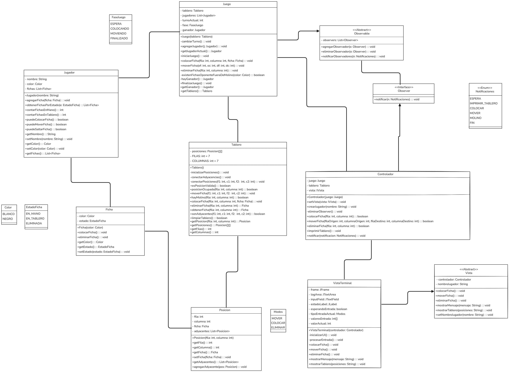

# Juego del Molino

## Reglas básicas del juego del molino

El juego del molino es un juego de mesa para dos jugadores. El objetivo es formar "molinos" (líneas de tres fichas propias en línea recta) y eliminar las fichas del oponente. El juego se desarrolla en dos fases principales:

1. **Colocación de fichas:**  
   Los jugadores colocan sus fichas por turnos en los posiciones vacíos del tablero.  
   Cada vez que un jugador forma un molino (tres fichas alineadas), puede eliminar una ficha del oponente que no forme parte de un molino.

2. **Movimiento de fichas:**  
   Cuando ambos jugadores han colocado todas sus fichas, comienzan a moverlas a posiciones adyacentes vacíos.  
   Si un jugador queda con solo tres fichas, puede moverlas a cualquier posicion vacío.  
   El juego termina cuando un jugador no puede mover o le quedan solo dos fichas.

## Responsabilidades de cada clase

### `Tablero`
- Representa el tablero del juego.
- Guarda las fichas y en qué posición está cada una.
- Revisa al colocar o mover una ficha si el movimiento es valido.
- Determina si hay un molino formado.
- Permite colocar, mover y eliminar fichas.

### `Posicion`
- Representa una posición válida en el tablero.
- Puede contener una ficha o estar vacía.
- Conoce sus posiciones adyacentes.

### `Ficha`
- Representa una ficha de un jugador.
- Puede tener diferentes estados: en mano, en tablero o eliminada.
- Sabe su color y estado actual.

### `Jugador`
- Representa a un jugador del juego.
- Tiene un nombre, un color asignado y una lista de fichas.
- Lleva el control de cuántas fichas tiene en mano y en el tablero.

### `Juego`
- Controla la lógica principal del juego.
- Gestiona los turnos y fases.
- Valida si un movimiento es legal segun las reglas del juego
- Administra los jugadores y determina el ganador.
- Notifica a los observadores sobre los cambios importantes.

### `Controlador`
- Intermedia entre la vista y el modelo.
- Recibe acciones de la vista y las traduce en operaciones sobre el modelo.
- Notifica a la vista sobre los cambios y mensajes relevantes.

### `Observable` y `Observer`
- Implementan el patrón observador para notificar cambios en el modelo.
- Permiten que la vista y otros componentes reaccionen a eventos del juego.

### `IVista` y `VistaTerminal`
- Definen la interfaz y la implementación de la vista del juego.
- Muestran el estado del juego y reciben las acciones del usuario.

---

Este proyecto implementa el juego del molino siguiendo el patrón MVC (Modelo-Vista-Controlador) y el patrón observador para la comunicación entre el modelo y la vista.

## UML

